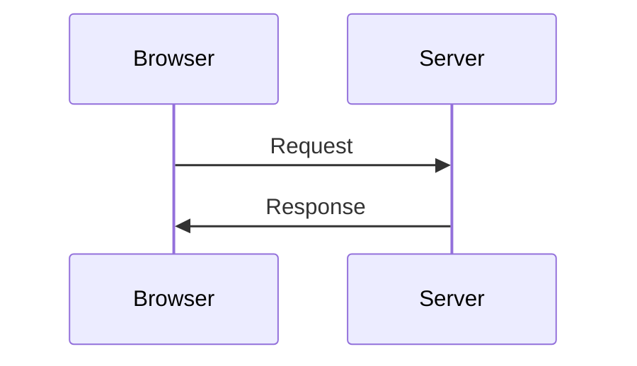
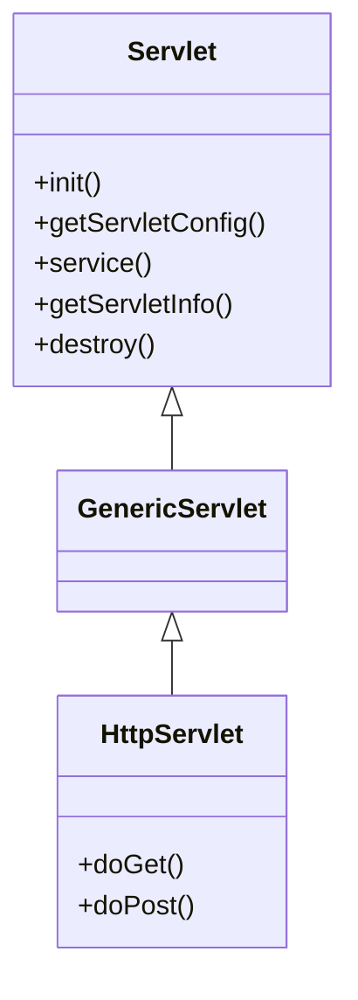
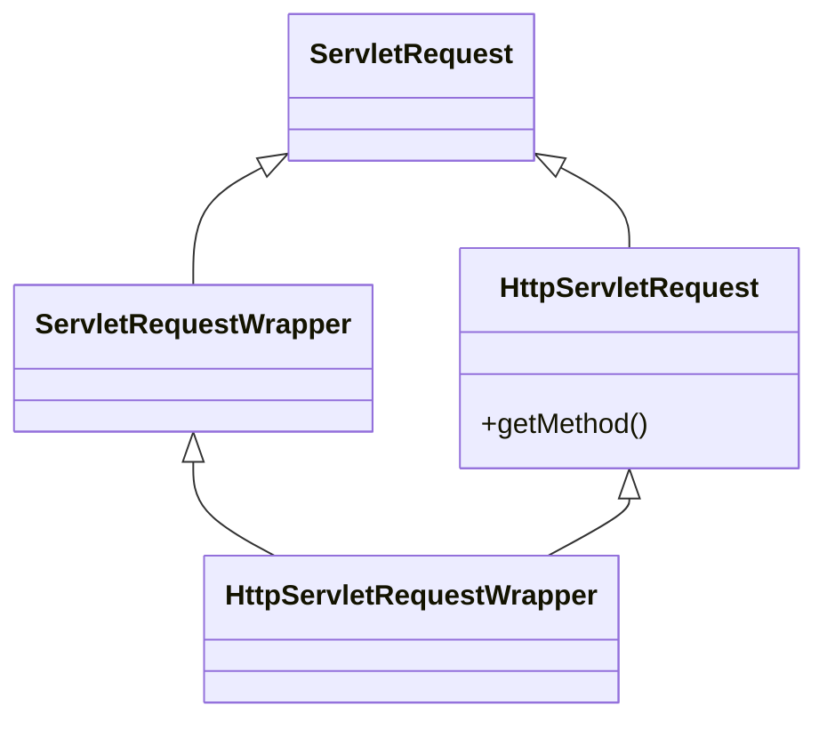
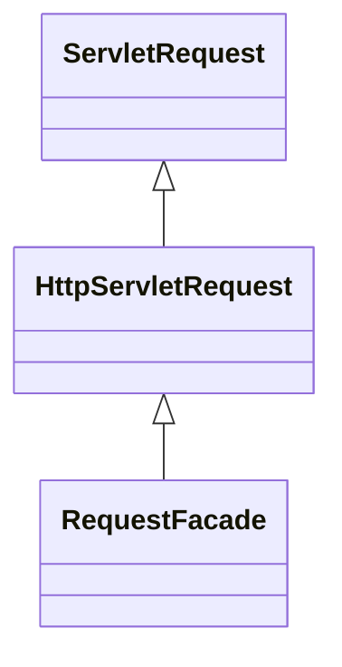
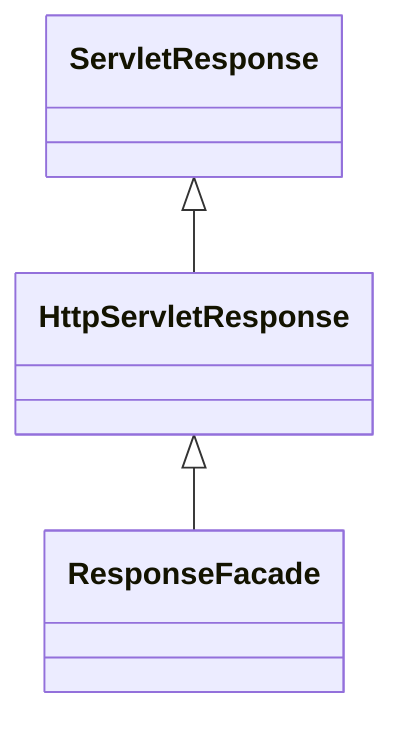

# JavaWeb简介

- Web：全球广域网，也称为万维网（www），是能够通过浏览器访问的网站
- **JavaWeb**：是用Java技术来解决相关互联网领域问题的**技术栈**
- 静态资源：html、css、JavaScript等，负责页面展现
- 动态资源：Servlet、JSP等，负责逻辑处理


# JavaWeb技术栈

## C/S架构

> C/S架构：Client/Server，客户端/服务器架构

```
  服务器通常采用高性能PC机或工作站，并采用大型数据库系统；客户端需要安装专用的客户端软件。这种结构可以充分利用两端硬件环境的优势，将任务合理分配到客户端和服务器，从而降低了系统的通信开销。
```


## B/S架构

> B/S架构：Browser/Server，浏览器/服务器架构模式。

```
  这种模式统一了客户端，将系统功能实现的核心部分集中到服务器上，简化了系统的开发。
  客户机只需要安装浏览器，而服务器负责连接数据库。
  浏览器通过Web Server同数据库进行数据交互。
```

好处：易于维护升级。软件升级时，系统维护员只需要将服务器的软件升级到最新版本，对于客户端，只要重新登录系统即可使用最新版本的软件。


# HTTP

> **HTTP**（**H**yper**T**ext Transfer **P**rotocol），超文本传输协议，规定浏览器和服务器数据传输的规则




HTTP协议特点：

1.  基于TCP协议：安全
2. HTTP协议是无状态协议：每次请求-响应都是独立的


## HTTP请求数据格式

请求数据分为三部分：

1. **请求行**：请求数据的第一行。其中Get表示请求方式，/表示请求资源路径，并且包含http协议版本
2. **请求头**：格式为key-value形式
3. **请求体**：POST请求的最后一部分，用于存放请求参数


常见的HTTP请求头：

- Host：表示请求的主机名
- User-Agent：浏览器版本
- Accept：表示浏览器能接收的资源类型，如image/*
- Accept-Language：表示浏览器偏好的语言
- Accept-Encoding：表示浏览器可以支持的压缩类型


GET请求和POST请求的区别：

1. GET请求参数在请求行中，没有请求体，POST请求参数在请求体中
2. GET请求参数大小有限制，而POST没有


## HTTP响应数据格式

响应数据分为三部分：

1. 响应行：响应数据的第一行，HTTP/1.1表示协议版本，200表示响应状态码，OK表示状态码描述

2. 响应头：格式为key-value形式

3. 响应体：存放响应数据


常见响应头：

- Content-Type：响应内容的类型，如text/html，image/jpeg
- Content-Length：表示响应内容的长度
- Content-Encoding：响应压缩算法
- Cache-Control：缓存控制，指示客户端应如何进行缓存，例如：max-age=300表示可以最多缓存300秒


### 响应状态码

响应状态码分类：

| 分类 | 描述                                                      |
| ---- | --------------------------------------------------------- |
| 1xx  | 信息，服务器收到请求，需要请求者继续执行操作              |
| 2xx  | 成功，操作被成功接收并处理                                |
| 3xx  | 重定向，需要客户端进一步操作以完成请求                    |
| 4xx  | 客户端错误，请求语法错误或无法完成请求，一般是请求url错误 |
| 5xx  | 服务器错误，服务器在处理请求的过程中发生了错误            |


响应状态码大全：https://cloud.tencent.com/developer/chapter/13553


# Tomcat


## Tomcat简介

Tomcat

> Tomcat是一个轻量级的Web服务器

- 概念：Tomcat是Apache软件基金会一个核心项目，是一个开源免费的**轻量级**Web服务器，支持Servlet/JSP少量JavaEE规范
- Tomcat也被称为Web容器、Servlet容器。Servlet需要依赖于Tomcat才能运行。
- 官网：https://tomcat.apache.org/


Web服务器：

- Web服务器是一段程序，对HTTP协议的操作进行封装，使得程序员不必直接对协议进行操作，让Web开发更加便捷。
- 功能：提供网上信息浏览服务


Web服务器作用：

- 封装HTTP协议操作，简化开发
- 可以将Web项目部署到服务器中，对外提供网上浏览服务


## Tomcat使用

### 基本使用

启动：bin目录下双击startup.bat

关闭：

1. 直接关闭控制台窗口：强制关闭
2. bin/shutdown.bat：正常关闭
3. Ctrl+c：正常关闭

控制台乱码：

- 原因：控制台默认编码gbk、Tomcat默认编码utf-8
- 解决：修改conf/logging.properties
  - java.util.logging.ConsoleHandler.encoding = GBK

修改端口号：conf/server.xml

```xml
<Connector port="8080" protocol="HTTP/1.1"
		   connectionTimeout="20000"
		   redirectPort="8443" />
```

[^注]: HTTP协议默认端口号为80，如果将Tomcat端口号改为80，则将来访问Tomcat时，将不用输入端口号


**问题**

窗口一闪而过：JAVA_HOME没有正确配置（Tomcat是用java实现的，会在启动时自动寻找JAVA_HOME）


### 部署项目

Tomcat部署项目：将项目放置到webapps目录下，即部署完成

一般将JavaWeb项目打成jar包，然后放到Tomcat的webapps目录下，Tomcat会自动解压缩成war文件


项目结构：

- 原项目中的代码（编译后的Java字节码文件和resources的资源文件）会打包到WEB-INF/classes目录下
- 原项目中导入的依赖会打包到WEB-INF/lib目录下


## IDEA使用Tomcat

1. 导入tomcat的maven依赖

   ```xml
   <build>
   	<plugins>
       	<plugin>
           	<groupId>org.apache.tomcat.maven</groupId>
               <artifactId>tomcat7-maven-plugin</artifactId>
               <version>2.1</version>
               <configuration>
               	<port>8080</port> 
                   <path>/</path>
               </configuration>
           </plugin>	
       </plugins>
   </build>
   ```

2. 使用Maven Helper插件快速启动项目，选中项目，右键、Run Maven、tomcat7:run


# Servlet


## Servlet简介

- 对于B/S交互而言：Servlet是Java提供的一门**动态**web资源开发技术
- 对于后端开发而言：Servlet是JavaEE规范之一，**本质是一个接口**，将来我们需要定义Servlet实现类实现Servlet接口，并交给web服务器运行Servlet


## Servlet快速入门

1. 创建web项目，导入Servlet依赖坐标

   ```xml
   <dependency>
   	<groupId>javax.servlet</groupId>
       <artifactId>javax.servlet-api</artifactId>
       <version>3.1.0</version>
       <scope>provided</scope> // Tomcat自带Servlet，部署时为了防止冲突，应将Servle的scope属性设为provided
   </dependency>
   ```

2. 定义Servlet实现类，重写接口中的所有方法

   ```
   public class ServletDemo implements Servlet{
   	public void service(){}
   }
   ```

3. 配置，在类上使用@WebServlet注解，配置Servlet的访问路径

   ```java
   @WebServlet("/demo")
   public class ServletDemo implements Servlet{}
   ```

4. 启动Tomcat，浏览器输入URL访问Servlet

   

## Servlet生命周期

对象的生命周期：一个对象从被创建到被销毁的整个过程


Servlet生命周期分为四个阶段：

1. 加载和实例化

   - 默认情况下：当Servlet第一次被访问时，由容器创建Servlet对象 

   - ```java
     @WebServlet(urlPatterns = "/demo", loadOnStartup = 1) // 这里的urlPatterns等价于value
     ```

     手动配置：设置loadOnStartup的值

     - 负整数：第一次访问时创建Servlet对象
     - 0或正整数：服务器启动时创建Servlet对象，数字越小优先级越高

2. 初始化：Servlet实例化之后，容器将调用Servlet的init()方法初始化这个对象，完成一些加载配置文件、创建连接等初始化的工作，该方法只调用一次

3. 请求处理：每次请求Servlet时，容器都会调用Servlet的service()方法对请求进行处理

4. 服务终止：当需要释放内存或者容器关闭时，容器就会调用Servlet实例的destroy()方法完成资源的释放。


##  Servlet继承体系


### Servlet

在B/S架构中，请求方式有多种，常见的如：get、post，不同的请求方式对应不同的操作。

因此，在HttpServlet中，将service()作为中转站，对不同请求方式调用不同代码。



HttpServlet对应service方法如下：

```java
protected void service(HttpServletRequest req, HttpServletResponse resp) throws ServletException, IOException {
        String method = req.getMethod();
        if (method.equals("GET")) {
            // 调用doget()方法
        } else if (method.equals("HEAD")) {
            // 调用doHead()方法
        } else if (method.equals("POST")) {
            // 调用doPost()方法
        } else if (method.equals("PUT")) {
            // 调用doPut()方法
        } else if (method.equals("DELETE")) {
            // 调用doDelete()方法
        } else if (method.equals("OPTIONS")) {
            // 调用doOptions()方法
        } else if (method.equals("TRACE")) {
            // 调用doTrace()方法
        } else {
            // 放回错误信息
        }

    }
```


### ServletRequest

使用HttpServlet判断请求方式时，需要先将ServletRequest转为HttpServletRequest对象，再调用getMethod()f方法。



## Servlet urlPattern配置


Servlet想要被访问，必须配置其访问路径

- 一个Servlet，可以配置多个urlPattern，方式如下：

  ```java
  @WebServlet(urlPatterns = {"/demo1", "/demo2"})
  ```

- urlPattern配置规则

  - 精确匹配：配置路径和访问路径相同

  - 目录匹配：

    ```java
    @WebServlet("/user/*") // 只要目录为user，就能访问到当前Servlet
    ```

  - 扩展名匹配

    ```java
    @WebServlet("*.do") // 只要扩展名为do，就能访问到当前Servlet
    // 注：路径前不能加/
    ```

  - 任意匹配

    ```java
    // 配置为/*的优先级高于配置为/的优先级
    @WebServlet("/")  
    @WebServlet("/*") 
    ```

    - 当项目中配置了"/"，会覆盖掉tomcat中的DefaultServlet，无法访问静态资源
    - 当项目中配置了"/*"，意味着匹配任意访问路径


# Request和Response

- Request：获取请求数据
- Response：设置响应数据


## Request


### 继承体系

RequestFacade由Tomcat创建



### 获取请求数据

1. 请求行 

   ```json
   GET /servlet-demo/req?username=zhangsan&password=123456 HTTP/1.1
   ```

   - String getMethod()：获取请求方式：GET
   - String getContextPath()：获取虚拟目录（项目访问路径）：/servlet-demo
   - StringBuffer getRequestURL()：获取URL（统一资源定位符）：http://localhost:8080/servlet-demo/req
   - String getRequestURI()：获取URI（统一资源标识符）：/servlet-demo/req
   - String getQueryString()：获取请求参数（GET方式）：username=zhangsan&password=123456

2. 请求头

   ```json
   User-Agent: Mozilla/5.0 (Windows NT 10.0; Win64; x64) AppleWebKit/537.36 (KHTML, like Gecko) Chrome/105.0.0.0 Safari/537.36 Edg/105.0.1343.33
   ```

   - String getHeader(String name)：根据请求头名称获取值

3. 请求体

   ```json
   username=zhangsan&password=123456
   ```

   - ServletInputStream getInputStream()：获取字节输入流
   - BufferedReader getReader()：获取字符输入流

---

**通用方式**获取请求参数

- GET获取请求参数：String getQueryString()

- POST获取请求参数：BufferedReader getReader()

  

如果GET逻辑和POST逻辑完全一样，而由于请求参数方式不同，需要写两份基本一样的doGet和doPost代码会十分冗余，因此ServletRequest封装了请求参数的通用方式：

- Map<String, String[]> getParameterMap()：获取所有参数Map集合
- String[] getParameterValues(String name)：根据名称获取参数值数组
- String[] getParameter(String name)：根据名称获取参数值

---


### 请求中文乱码


浏览器URL编码方式默认是UTF-8，而Tomcat的URL解码方式默认是ISO-8859-1 

```java
public void doGet(HttpServletRequest req, HttpServletResponse resp) {
    // 对于Post请求
    // req.setCharacterEncoding("UTF-8");
    
    // 对于Get请求
    String name = req.getParameter("name");
    // 重新编码
	byte[] bytes = name.getBytes("ISO-8859-1");
    // 重新解码
    String result = new String(bytes, "UTF-8");
}
```


### 请求转发

- 请求转发：一种在服务器内部的资源跳转方式

- 实现方式

  ```java
  req.getRequestDispatcher("资源路径").forward(req, resp);
  ```

- 请求转发资源间共享数据：使用（Http）ServletRequest对象

  - void setAttribute(String name, Object o)：存储数据到request域中
  - Object getAttribute(String name)：根据key，获取值
  - void removeAttribute(String name)：根据key，删除键值对


特点：

- 浏览器地址栏路径不变
- 只能转发到当前服务器内部资源
- 可以使用request共享数据（一次请求，对应一个request对象）


## Response


### 继承体系




### Response设置响应数据

响应数据分为三部分：

1. 响应行：HTTP/1.1 200 OK

   ```java
   void setStatus(int sc) // 设置响应状态码
   ```

2. 响应头：Content-Type: text/html

   ```java
   void setHeader(String name, String value)
   ```

3. 响应体

   ```java
   PrintWriter getWriter() // 获取字符输出流
   ServletOutputStream getOutputStream() // 获取字节输出流
   ```

   - 输出流不需要手动关闭，当response对象被销毁时，由服务器自动关闭

   - 中文乱码：

     ```java
     resp.setContentType("text/html;charset=utf-8");
     ```

     

### Response重定向

- 重定向（Redirect）：一种资源跳转的方式

- 实现方式

  ```java
  // 方式一
  resp.setStatus(302);
  resp.setHeader("location","资源路径");
  
  // 方式二
  resp.sendRedirect("资源路径");
  ```

  

重定向特点：

- 浏览器地址栏发生变化
- 可以重定向到任意位置的资源
- 两次请求，不能在多个资源中使用request共享数据


# JSP

- 概念：JSP（**J**ava **S**erver **P**ages），Java服务端页面


