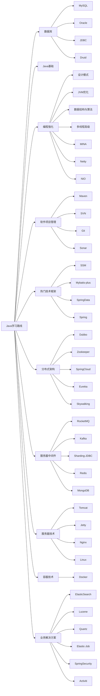

```mermaid
graph LR
Java学习路线-->数据库
Java学习路线-->Java基础
Java学习路线-->编程强化
Java学习路线-->软件项目管理
Java学习路线-->热门技术框架
Java学习路线-->分布式架构
Java学习路线-->服务器中间件
Java学习路线-->服务器技术
Java学习路线-->容器技术
Java学习路线-->业务解决方案

数据库-->MySQL
数据库-->Oracle
数据库-->JDBC
数据库-->Druid

编程强化-->设计模式
编程强化-->JVM优化
编程强化-->数据结构与算法
编程强化-->多线程高级
编程强化-->MINA
编程强化-->Netty
编程强化-->NIO

软件项目管理-->Maven
软件项目管理-->SVN
软件项目管理-->Git
软件项目管理-->Sonar

热门技术框架-->SSM
热门技术框架-->Mybatis-plus
热门技术框架-->SpringData
热门技术框架-->Spring

分布式架构-->Dubbo
分布式架构-->Zookeeper
分布式架构-->SpringCloud
分布式架构-->Eureka
分布式架构-->Skywalking

服务器中间件-->RocketMQ
服务器中间件-->Kafka
服务器中间件-->Sharding-JDBC
服务器中间件-->Redis
服务器中间件-->MongoDB

服务器技术-->Tomcat
服务器技术-->Jetty
服务器技术-->Nginx
服务器技术-->Linux
 
容器技术-->Docker

业务解决方案-->ElasticSearch
业务解决方案-->Lucene
业务解决方案-->Quartz
业务解决方案-->Elastic-Job
业务解决方案-->SpringSecurity
业务解决方案-->Activiti

```

设计模式

计算机网络

RocketMQ消息队列

Nginx网关

