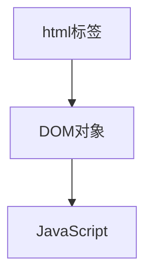

# JavaScript简介

- JavaScript（简称JS）是一门跨平台、面向对象的脚本语言，用来控制网页行为，能使网页可交互
- JavaScript由以下三部分构成：ECMAScript、DOM、BOM


# JavaScript基础语法

- 区分大小写
- 结尾分号可有可无

 

## 输出语句

```javascript
// 写入警告框 alert默认window.alert()
window.alert() 

// 写入html页面
document.write()

// 写入浏览器控制台
console.log()
```


## 变量

- JavaScript是一门弱类型语言，变量可以存放不同类型的值
- JavaScript使用var关键字（variable）来声明变量
- 组成字符可以是任何字母、数字、下划线或美元符号（$）
  - 不能以数字开头
- ECMAScript6
  - 新增了let关键字，用来定义变量，但所声明的变量只在let关键字所在代码块内有效，并且不允许重复声明
  - 新增了const关键字，用来声明只读常量，一旦声明，常量的值就不能改变


## 数据类型

JavaScript中数据类型分为：原始类型、引用类型


5种原始类型：

- number：数字（整数、小数、NaN）
- string：字符串
- boolean：布尔
- null：空对象
- undefined：声明变量未初始化


类型转换：

1. 其他类型转为number：
   - string：按照字面值进行转换；如果字面值不是数字，则转为NaN。转换方式：parseInt
   - boolean：true为1，false为0
2. 其他类型转为boolean
   - number：0和NaN转为false，其他转为true
   - string：空字符串（不包括全为空格的字符串）转为false，其他转为true
   - null、undefined：转为false

## 函数

函数（方法）是被设计为执行特定任务的代码块

JavaScript通过function关键词进行定义

- 形式参数不需要类型
- 返回值不需要类型，直接在函数内部return返回值即可

```javascript
// 定义方式1
function add(a, b) {
    return a + b;
}

let result = add(1, 2);

// 定义方式2
var add = function(a, b) {
    return a + b;
}

// 调用：JS中，函数调用可以传递任意个参数
let result = add(1, 2);
let result = add(1); // 返回结果为NaN
let result = add(1, 2, 3); // 返回结果为3
```


# JavaScript常用对象

- Array
- String
- 自定义对象


## Array

JavaScript的Array类似Java中的集合，数组的长度和类型都可变

**定义**

```javascript
var arr = new Array(a, b, ...) // 方式1

var arr = [a, b, ...] // 方式2
```

**操作**

```javascript
var arr = [1, 2, 3];

// 添加
arr.push(10);

// 删除
arr.splice(start, number) // 从start开始删除number个元素
```


## String

**定义**

```javascript
var str = new String(s); // 方式1
var str = s; // 方式2
```

**方法**

```javascript
length // 长度
charAt(); // 返回指定位置的字符
indexOf(); // 字符出现的下标

trim(); // 去除字符串两端空白字符
```


## 自定义对象

```javascript
var person = {
    name:"Tom"
    age:20
    print:function() {
        alert(name + "年龄:" + age)
    }
}
```


# Bom

- BOM（**B**rowser **O**bject **M**odel）：浏览器对象模型
- JavaScript将浏览器的各个组成部分封装成对象


BOM对象：

- Window：浏览器窗口对象
- Navigator：浏览器对象
- Screen：屏幕对象
- History：历史记录对象
- Location：地址栏对象


## Window

**方法**

```javascript
alert(); // 显示带有一段消息和一个确认按钮的警告框
confirm(); // 显示带有一段消息以及确认和取消按钮的对话框
setInterval(function, 毫秒值); // 按照指定周期来调用函数或计算表达式
setTimeout(function, 毫秒值); // 在指定毫秒后调用函数或计算表达式
```


## History

**获取**

```javascript
window.history.method(); // method为history的方法
```

**方法**

```javascript
back(); // 加载history列表中的前一个url
forward(); // 加载history列表中的下一个url
```


## Location

**属性**

```javascript
href

location.href = "https://www.baidu.com"
```


# DOM




- DOM（**D**ocument **O**bject **M**odel）：文档对象模型

- DOM式W3C（万维网联盟）的标准

- W3C标准被分为三个不同的部分

  - 核心DOM：针对任何结构化文档的标准模型
    - Document：文档对象
    - Element：元素对象
    - Attribute：属性对象
    - Text：文本对象
    - Comment：注释对象
  - XML DOM：针对XML文档的标准模型
  - HTML DOM：准对HTML文档的标准模型

  

## Element

**获取**

```javascript
getElementById // 根据id属性返回一个Element对象
getElementsByTagName // 根据标签名称返回Element对象数组
getElementsByName // 根据name属性返回Element对象数组
getElementsByClassName // 根据class属性返回Element对象数组

document.getElementById("id")
document.getElementsByTagName("div")
```


# 事件监听

- 事件：发生在html元素上的操作
- 事件监听：JavaScript可以在事件发生时执行对应操作	
  - 事件绑定
  - 常见事件


## 事件绑定

```javascript
// 通过html标签中的事件属性进行绑定
<input type="button" onclick='on()'>
    
function on() {
    alert();
}

// 通过DOM元素属性绑定（推荐）
<input type="button" id="btn">
    
document.getElementById("btn").onclick = function() {
    alert();
}
```


## 正则表达式

概念：正则表达式定义了字符串组成的规则

定义：

```javascript
// 直接量
var reg = /^\w{6,12}$/;

// 创建RegExp对象
var reg = new RegExp("^\\w{6,12}$");
```

语法：

- ^：表示开始
- $：表示结束
- []：代表范围，[0,9]单个数字字符
- .：代表任意单个字符，除了换行和结束符
- \w：代表单词字符：字母、数字、下划线
- \d：代表数字字符
- +：至少一个
- *：零个或多个
- ？：零个或一个
- {x}：x个
- {m,}：至少m个
- {m, n}：m到n个

```javascript
var reg = /^\w{6,12}$/;

var str = "abc";

var flag = reg.test(str)
```

