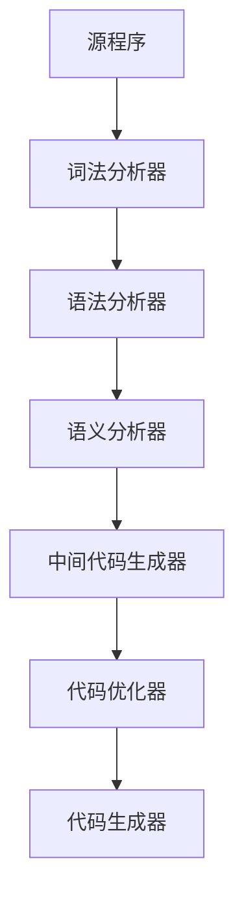

# 编译简介

## 编译器

> 基本概念

编译器是一段程序，它读入用源语言编写的程序并翻译成等价的目标语言程序。编译器还能够向用户报告被编译的源程序的错误。


> 编译的组成部分

编译由两部分组成：

- 分析：将源程序切分成基本块，形成源程序的中间表示
- 综合：将源程序的中间表示转换成所需的目标程序


分析的作用：确定源程序操作，生成语法树。（语法树每个节点表示一个操作，子节点表示操作的参数）


## 源程序分析

> 阶段

1. 线性分析：从左到右读取构成源程序的字符流，把字符流分组为多个记号（具有整体含义的字符序列）
2. 层次分析：字符串或记号在层次上划分为具有一定层次的多个嵌套组，每个嵌套组具有整体的含义
3. 语义分析：进行检查，确保程序各部分是有意义组合在一起的


> 词法分析

在编译器中，**线性分析**被称为词法分析或扫描。

对于如下语句：position = initial + rate * 60，会被分解成记号组：

1. 标识符：position
2. 赋值符号：=
3. 标识符：initial
4. 加号：+
5. 标识符：rate
6. 乘号：*
7. 数字：60


> 语法分析

**层次分析**被称为语法分析，会把源程序的记号进一步分组，产生被编译器用于生成代码的语法短语，通常用语法分析树来表示


> 语义分析

作用：检测源程序的语义错误，并收集代码生成阶段要用到的类型信息。通过语法分析阶段确定的层次结构来识别表达式和语句中的操作符和操作数


语义分析：

- 类型检查（强制类型转换）


## 编译器的各个阶段




### 中间代码生成

在完成语法分析和语义分析后，需要生成源程序的显式中间表示

源程序的中间代码应具有两个重要性质：

- 易于产生
- 易于翻译成目标程序


```c
// 源代码
position = initial + rate * 60

// 中间代码
temp1 = inttoreal(60);
temp2 = id3 * temp1;
temp3 = id2 + temp2;
id1 := temp3;
```


### 代码优化

代码优化会试图改进中间代码，从而产生执行速度更快的机器代码。

```c
temp1 = id3 * 60.0;
id1 := id2 + temp1;
```


### 代码生成

代码生成：生成可重定位的机器代码或者汇编代码

```
MOVF id3, R2
MULF #60.0, R2
MOVF id2, R1
ADDF R2, R1
MOVF R1, id1
```


## 编译器各阶段分组

在编译器的实际实现中，多个阶段的任务可能被组合在一起


### 前端与后端

编译的多个阶段可以分为前端和后端两个大的阶段


> 前端

包括依赖于源语言并在很大程度上独立于目标机器的某些阶段或者某些阶段的某些部分

包括：

- 词法分析
- 语法分析
- 符号表的建立
- 语义分析
- 中间代码生成
- 相关的错误处理
- 一部分代码优化工作


> 后端

包括编译器中依赖于目标机器的阶段或者某些阶段的某些部分

包括：

- 代码优化
- 代码生成
- 相关错误处理
- 符号表的操作


### 编译器的遍

编译器的若干阶段通常是以一边来实现的。一遍读一次输入文件、产生一个输出文件。但编译器各阶段的组合方式多种多样，因此我们按照阶段而不是按遍来讨论编译器


# 一遍编译器

通过开发一个把中缀表达式转换成后缀表达式的C程序来展示基本编译技术


## 概述

程序设计语言描述的两个方面：

- 程序模式，即语言的语法
- 程序含义：即语言的语义


为说明语言的语法，介绍一种使用广泛的表示法：上下文无关文法/BNF（Backus-Naur范式）

上下文无关文法可以定义语言的语法，还可以用于指导源程序的翻译。面向语法的编译技术，如语法制导编译技术


## 语法定义

### 上下文无关文法

上下文无关文法：一种定义语言的表示法
$$
stmt -> if(expr) \, stmt \\ else \, stmt
$$
stmt：标识一条语句

expr：标识表达式


像关键字if和括号这样的词法元素称为**记号**（token），像expr和stmt这样的变量标识一个记号序列，称为**非终结符**（nonterminal）


上下文无关文法包含四个部分：

1. 一个记号集合，称为终结符号
2. 一个非终结符集合
3. 一个产生式集合。每个产生式有一个左部和右部，左部和右部由箭头连接，左部是非终结符，右部是记号和（或）非终结符序列
4. 一个开始符号。开始符号是一个指定的非终结符


从开始符号出发，反复替代产生式中的非终结符，一个文法可产生一个串。由一个文法的开始符号产生的记号串形成了该文法定义的语言。


> 例子

加减法的产生式定义：
$$
list -> list + digit \\ 
list -> list - digit \\
list -> digit \\ 
digit -> 0 | 1 | 2 | 3 | 4 | 5 | 6 | 7 | 8 | 9
$$


> 分析树

如果非终结符A有一个产生式:
$$
A->XYZ
$$
则A的分析树如图：


分析树的特性：

1. 树根标记为开始符号
2. 每个叶节点由记号或$\epsilon$标记
3. 每个内节点由一个非终结符标记
4. 如果A是某个内节点的非终结符标记，X1，X2，...，Xn是该节点从左到右排列的所有子节点标记，则A->X1X2...Xn是一个产生式


使用分析树的概念，可以定义：一个文法生成的语言是它的某个分析树生成的串的集合。为给定的记号串找到一个分析树的过程称为串的语法分析。


### 二义性

一棵分析树生成唯一的串，但一个文法对应多棵分析树可能生成相同的记号串，这样的文法称为具有二义性的文法


## 语法制导翻译


### 语法制导定义

语法制导定义使用上下文无关文法来说明输入的语法结构


# 文法

## 文法的构成

文法直观上可以划分为：

- 非终结符
- 终结符
- 开始符号
- 规则


> 定义

一个文法G[S]可以表示成如（Vn，Vt，P，S）的四元组

- Vn：非终结符集
- Vt：终结符集
- P：产生式
- S：$S\in Vn$，文法的开始符号
- V：$V=Vn\bigcup Vt$称为文法的字母表或字汇表


## 文法的分类

> 0型文法

- 产生式形如：$a\rightarrow b$
- a、b属于字符串的闭包区间并且a至少含有一个非终结符
- 例子：$AB\rightarrow ab$


> 1型文法

- 产生式形如：$a\rightarrow b$
- |a|<=|b|，a推导出空串除外
- 例子：$A\rightarrow Bb$


> 2型文法

- 产生式形如：$A\rightarrow b$
- 式子左边必须是非终结符；式子右边可以有多个终结符或非终结符


> 3型文法

左线性文法

- 产生式形如：$A\rightarrow Bw$

右线性文法

- 产生式形如：$A\rightarrow aB$


3型文法产生的语言称为3型语言，它可由有限自动机识别


## 文法构造正则式

> 右线性文法

- 正则文法：$S\rightarrow aS | b$
- 等价正则式：$a^*b$


> 左线性文法

- 正则文法：$S\rightarrow Sa | b$
- 正则式：$ba^*$


## DFA

DFA（Deterministic Finite Automaton）：确定有限状态自动机


> DFA定义

$M=(K,\sum,f,S0,Z)$

- K：状态集合
- $\sum$：字母表，表示触发事件
- f：函数，表示一个状态接收某个字母转移到另一个状态
- S0：初态
- Z：终态


函数f的推广定义

f^：表示某状态接收一个字母串转移到另一状态


> dfa识别的语言

定义L(M)={x | f(S0, x) $\in$Z, x $\in$ $\sum$*}


## NFA

> 定义

$N=(K,\sum,f,S0,Z)$

- K：状态集合
- $\sum$：字母表，表示触发事件
- f：$K \times \sum \rightarrow p(K)$函数，即一个状态接收一个输入字母后，到达的状态可能存在多个
- S0：初态
- Z：终态


> NFA识别的语言

定义$L(N)= \{  x | f(S0, x) \bigcap Z \neq \emptyset, x \in \sum^* \}$


